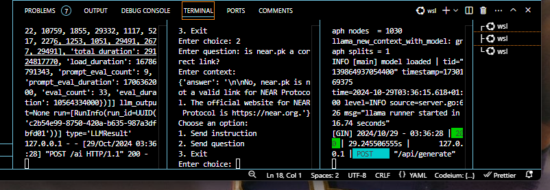
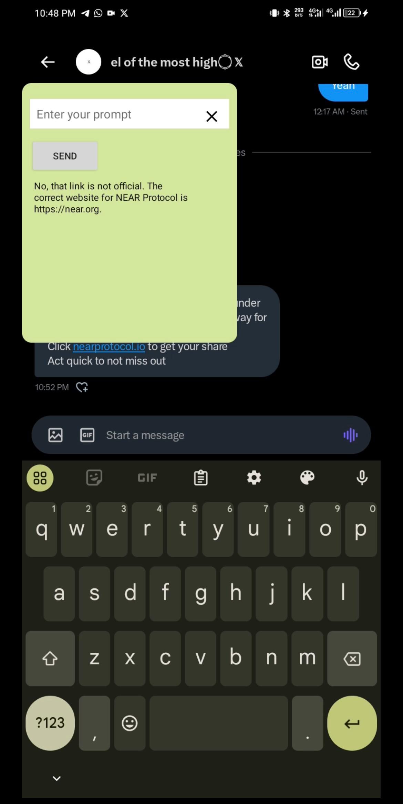

  

## XWIFTRX AI for [REDACTED] Hackathon

Introducing Xwiftrx AI, your all-in-one solution for navigating the Web3 landscape with confidence. Our AI safeguards you from scams, streamlines NEAR transactions, and simplifies token bridging—all within a convenient overlay. With Xwiftrx AI, you can effortlessly manage your Web3 activities without leaving your current app, ensuring a secure and efficient experience. Embrace the future of blockchain interactions with Xwiftrx AI!

### Submitted for the Native Track Category

## Technologies Used

- **NEAR Protocol**
- **Py-NEAR**
- **Hugging Face**
- **Kotlin**
- **Ollama**
- **Google Colab**

## How We Built It

- **App Development:** Built with Kotlin for native feature support.
- **Dataset Creation:** Collated data and created datasets deployed on [Hugging Face repo](https://huggingface.co/datasets/yorxsm/neart-dataset) and [second dataset](https://huggingface.co/datasets/yorxsm/neartrx-dataset).
- **Model Training:** Picked a LLM with prompt function capabilities, trained it with the dataset on Colab, and deployed it [here](https://huggingface.co/yorxsm/xw_model).
- **Model Execution:** Used Ollama to run the model (lacked sufficient compute power).
- **Python Integration:** Wrote a Python script to interface the trained model with the frontend using Py-NEAR to handle transactions.
- **Deployment:** Initially deployed on a cloud platform to test app functionalities with AI (removed due to high costs).

## Recreate Function with CLI

- Download the [model](https://huggingface.co/yorxsm/xw_model).
- Create a modelfile.
- Serve with Ollama.
- Add testnet details to the environment.
- Launch with `python app.py` and `python test_cli.py`.
- Prompts like: "What is NEAR?", "Send 2 NEAR to a testnet address", "Is this link safe?" will work perfectly.

### Example Images

## Challenges Faced

- Learning new technologies within a limited timeframe.
- Resources needed for model training.
- Difficulty obtaining APIs for token bridging and MPC integration.

## License

This work is licensed under a [MIT License](https://mit-license.org/).
